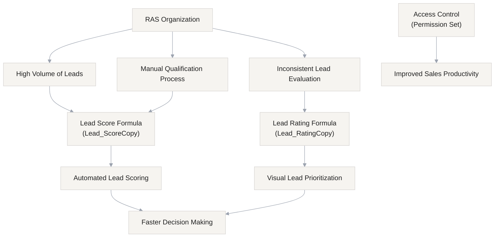

## Business Context

**Rambunctious Armadillo Socks (RAS)** is a large-scale retail organization with complex sales operations and a rapidly growing customer base.

Following a recent marketing campaign, the organization experienced a significant increase in inbound leads. While this growth is positive, it has introduced challenges in lead qualification, prioritization, and conversion efficiency.

RAS requires a scalable, automated solution to:

- Improve lead qualification accuracy
- Reduce manual effort for sales representatives
- Enable faster and more informed decision-making
- Ensure consistent evaluation of lead quality

## Business Overview



## Challange 01 : Build Lead Score and Rating Fields

Build the Lead Score and Lead Rating fields according to the business requirements. Tip: Test the outcome of your solutions with test records and data.

Design and implement a solution using **Salesforce Formula Fields** to:

1. Automatically calculate a **Lead Score** based on predefined business rules
2. Provide a **visual Lead Rating** to help sales teams quickly assess lead quality

All implementations must follow Salesforce best practices, including:

- Proper field documentation (Description and Help Text)
- Enforcement of **least privilege access**

## Task 01: Lead Score

Use the score ranges below to build the second field with the label **Lead Rating** and name `Lead_RatingCopy`. Similar to the Lead Score field, this field should only be visible to users with the **Sales Representative** permission set. Accessibility for screen reader users is a requirement at RAS. Your solution must include alternate text for each displayed image.

| **Lead Score Range** | **Alternate Text** | **Image URL\\\***             |
| -------------------- | ------------------ | ----------------------------- |
| < 10                 | 0 Star             | /img/samples/stars\\\_000.gif |
| 10 - 19              | 1 Star             | /img/samples/stars\\\_100.gif |
| 20 - 29              | 2 Star             | /img/samples/stars\\\_200.gif |
| 30 - 39              | 3 Star             | /img/samples/stars\\\_300.gif |
| 40 - 49              | 4 Star             | /img/samples/stars\\\_400.gif |
| ≥ 50                 | 5 Star             | /img/samples/stars\\\_500.gif |

<details>
<summary><strong>Logic Summary</strong></summary>

### Field Configuration

| Attribute | Value                        |
| --------- | ---------------------------- |
| Label     | Lead Score                   |
| API Name  | Lead_ScoreCopy               |
| Type      | Formula (Number, 0 decimals) |
| Access    | Sales Representative         |

### Key Rule

If status is **Closed - Not Converted**, score is always **0**.

</details>

### Solution

<details>
<summary><strong>Hint</strong></summary>

- Closed leads → **Score = 0 (override)**
- Do Not Call → **-25**
- Email present → **+15**
- Lead Source:
  - Web → +20
  - Phone Inquiry → +35
  - Partner Referral → +25
  - Purchased List → +10

</details>

<details>
<summary><strong>View Formula</strong></summary>

```java
IF(
    ISPICKVAL(Status, "Closed - Not Converted"),
    0,
    IF(DoNotCall, -25, 0)
    +
    IF(NOT(ISBLANK(Email)), 15, 0)
    +
    CASE(
        LeadSource,
        "Web", 20,
        "Phone Inquiry", 35,
        "Partner Referral", 25,
        "Purchased List", 10,
        0
    )
)
```

</details>

[Lead Score Field XML](fields/Lead_ScoreCopy.field-meta.xml)

---

## Task 02: Lead Rating

Use the score ranges below to build the second field with the label **Lead Rating** and name `Lead_RatingCopy`. Similar to the Lead Score field, this field should only be visible to users with the **Sales Representative** permission set. Accessibility for screen reader users is a requirement at RAS. Your solution must include alternate text for each displayed image.

| **Lead Score Range** | **Alternate Text** | **Image URL\\\***             |
| -------------------- | ------------------ | ----------------------------- |
| < 10                 | 0 Star             | /img/samples/stars\\\_000.gif |
| 10 - 19              | 1 Star             | /img/samples/stars\\\_100.gif |
| 20 - 29              | 2 Star             | /img/samples/stars\\\_200.gif |
| 30 - 39              | 3 Star             | /img/samples/stars\\\_300.gif |
| 40 - 49              | 4 Star             | /img/samples/stars\\\_400.gif |
| ≥ 50                 | 5 Star             | /img/samples/stars\\\_500.gif |

\*The image URLs provided relate to sample images that are available for use in every Salesforce org.

<details>
    <summary><strong>Logical Summary</strong></summary>

## Field Configuration

| Attribute | Value                |
| --------- | -------------------- |
| Label     | Lead Rating          |
| API Name  | Lead_RatingCopy      |
| Type      | Formula (Text)       |
| Access    | Sales Representative |

### Purpose

Provides a **visual star rating** based on Lead Score for quick decision-making.

</details>

---

### Solution

<details>
    <summary><strong>Hint</strong></summary>

### Rating Logic

| Score | Rating |
| ----- | ------ |
| < 10  | 0 Star |
| 10–19 | 1 Star |
| 20–29 | 2 Star |
| 30–39 | 3 Star |
| 40–49 | 4 Star |
| ≥ 50  | 5 Star |

</details>

<details>
<summary><strong>View Formula</strong></summary>

```java
CASE(
    TRUE,
    Lead_ScoreCopy < 10, IMAGE("/img/samples/stars_000.gif", "0 Star"),
    Lead_ScoreCopy < 20, IMAGE("/img/samples/stars_100.gif", "1 Star"),
    Lead_ScoreCopy < 30, IMAGE("/img/samples/stars_200.gif", "2 Star"),
    Lead_ScoreCopy < 40, IMAGE("/img/samples/stars_300.gif", "3 Star"),
    Lead_ScoreCopy < 50, IMAGE("/img/samples/stars_400.gif", "4 Star"),
    IMAGE("/img/samples/stars_500.gif", "5 Star")
)
```

</details>

[Lead Rating Field XML](fields/Lead_RatingCopy.field-meta.xml)

---

### Security

- Field access restricted to **Sales Representative** permission set
- Follows **least privilege principle**

---

### Outcome

- Faster lead qualification
- Consistent scoring
- Improved prioritization
- Better decision-making

---
