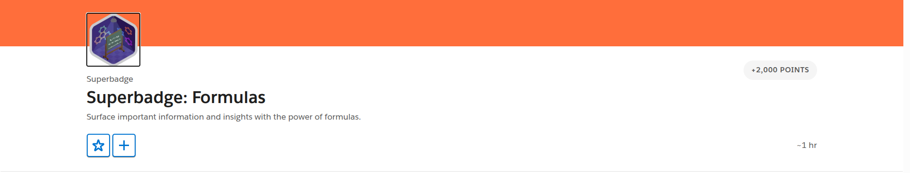
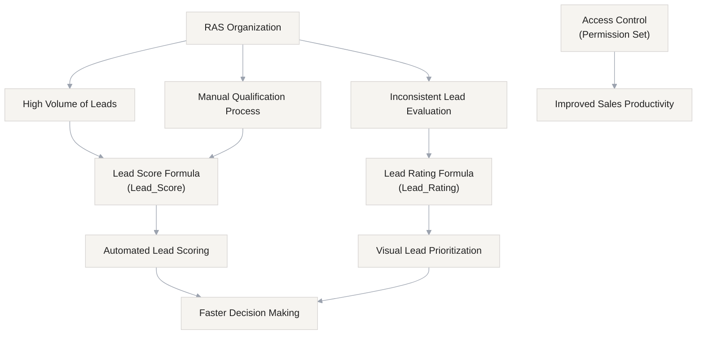
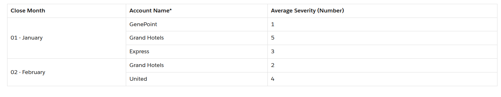

## Business Context

**Rambunctious Armadillo Socks (RAS)** is a large-scale retail organization with complex sales operations and a rapidly growing customer base.

Following a recent marketing campaign, the organization experienced a significant increase in inbound leads. While this growth is positive, it has introduced challenges in lead qualification, prioritization, and conversion efficiency.

RAS requires a scalable, automated solution to:

- Improve lead qualification accuracy
- Reduce manual effort for sales representatives
- Enable faster and more informed decision-making
- Ensure consistent evaluation of lead quality

## Business Overview



## Challange 01 : Build Lead Score and Rating Fields

Build the Lead Score and Lead Rating fields according to the business requirements. Tip: Test the outcome of your solutions with test records and data.

Design and implement a solution using **Salesforce Formula Fields** to:

1. Automatically calculate a **Lead Score** based on predefined business rules
2. Provide a **visual Lead Rating** to help sales teams quickly assess lead quality

All implementations must follow Salesforce best practices, including:

- Proper field documentation (Description and Help Text)
- Enforcement of **least privilege access**

### Task 01: Lead Score

Use the score ranges below to build the second field with the label **Lead Rating** and name `Lead_Rating`. Similar to the Lead Score field, this field should only be visible to users with the **Sales Representative** permission set. Accessibility for screen reader users is a requirement at RAS. Your solution must include alternate text for each displayed image.

| **Lead Score Range** | **Alternate Text** | **Image URL\\\***             |
| -------------------- | ------------------ | ----------------------------- |
| < 10                 | 0 Star             | /img/samples/stars\\\_000.gif |
| 10 - 19              | 1 Star             | /img/samples/stars\\\_100.gif |
| 20 - 29              | 2 Star             | /img/samples/stars\\\_200.gif |
| 30 - 39              | 3 Star             | /img/samples/stars\\\_300.gif |
| 40 - 49              | 4 Star             | /img/samples/stars\\\_400.gif |
| ≥ 50                 | 5 Star             | /img/samples/stars\\\_500.gif |

<details>
<summary><strong>Logic Summary</strong></summary>

### Field Configuration

| Attribute | Value                        |
| --------- | ---------------------------- |
| Label     | Lead Score                   |
| API Name  | Lead_Score                   |
| Type      | Formula (Number, 0 decimals) |
| Access    | Sales Representative         |

### Key Rule

If status is **Closed - Not Converted**, score is always **0**.

</details>

### Solution

<details>
<summary><strong>Hint</strong></summary>

- Closed leads → **Score = 0 (override)**
- Do Not Call → **-25**
- Email present → **+15**
- Lead Source:
  - Web → +20
  - Phone Inquiry → +35
  - Partner Referral → +25
  - Purchased List → +10

</details>

<details>
<summary><strong>View Formula</strong></summary>

```java
IF(
    ISPICKVAL(Status, "Closed - Not Converted"),
    0,
    IF(DoNotCall, -25, 0)
    +
    IF(NOT(ISBLANK(Email)), 15, 0)
    +
    CASE(
        LeadSource,
        "Web", 20,
        "Phone Inquiry", 35,
        "Partner Referral", 25,
        "Purchased List", 10,
        0
    )
)
```

</details>

[Lead Score Field XML](fields/Lead_Score.field-meta.xml)

---

### Task 02: Lead Rating

Use the score ranges below to build the second field with the label **Lead Rating** and name `Lead_Rating`. Similar to the Lead Score field, this field should only be visible to users with the **Sales Representative** permission set. Accessibility for screen reader users is a requirement at RAS. Your solution must include alternate text for each displayed image.

| **Lead Score Range** | **Alternate Text** | **Image URL\\\***             |
| -------------------- | ------------------ | ----------------------------- |
| < 10                 | 0 Star             | /img/samples/stars\\\_000.gif |
| 10 - 19              | 1 Star             | /img/samples/stars\\\_100.gif |
| 20 - 29              | 2 Star             | /img/samples/stars\\\_200.gif |
| 30 - 39              | 3 Star             | /img/samples/stars\\\_300.gif |
| 40 - 49              | 4 Star             | /img/samples/stars\\\_400.gif |
| ≥ 50                 | 5 Star             | /img/samples/stars\\\_500.gif |

\*The image URLs provided relate to sample images that are available for use in every Salesforce org.

<details>
    <summary><strong>Logical Summary</strong></summary>

### Field Configuration

| Attribute | Value                |
| --------- | -------------------- |
| Label     | Lead Rating          |
| API Name  | Lead_Rating          |
| Type      | Formula (Text)       |
| Access    | Sales Representative |

### Purpose

Provides a **visual star rating** based on Lead Score for quick decision-making.

</details>

---

### Solution

<details>
    <summary><strong>Hint</strong></summary>

### Rating Logic

| Score | Rating |
| ----- | ------ |
| < 10  | 0 Star |
| 10–19 | 1 Star |
| 20–29 | 2 Star |
| 30–39 | 3 Star |
| 40–49 | 4 Star |
| ≥ 50  | 5 Star |

</details>

<details>
<summary><strong>View Formula</strong></summary>

```java
CASE(
    TRUE,
    Lead_Score < 10, IMAGE("/img/samples/stars_000.gif", "0 Star"),
    Lead_Score < 20, IMAGE("/img/samples/stars_100.gif", "1 Star"),
    Lead_Score < 30, IMAGE("/img/samples/stars_200.gif", "2 Star"),
    Lead_Score < 40, IMAGE("/img/samples/stars_300.gif", "3 Star"),
    Lead_Score < 50, IMAGE("/img/samples/stars_400.gif", "4 Star"),
    IMAGE("/img/samples/stars_500.gif", "5 Star")
)
```

</details>

[Lead Rating Field XML](fields/Lead_Rating.field-meta.xml)

---

### Security

- Field access restricted to **Sales Representative** permission set
- Follows **least privilege principle**

---

### Outcome

- Faster lead qualification
- Consistent scoring
- Improved prioritization
- Better decision-making

---

## Challenge 02 : Increase Visibility and Enhance Decision-Making for Service Teams

Service agents at RAS manage a large volume of cases and pride themselves in their award-winning customer service. Agents regularly review customers’ asset records to see what products have been purchased in addition to other important information to inform the way they manage the case. The service leadership team would like service agents to be able to see the opportunity amount associated with each asset record. The opportunity amount is important for decision-making purposes and service-level agreements.

### Task 01 : Increase Visibilty

Build a solution that allows users with the existing **Service Agent** permission set to view the amount from the related opportunity record without granting access to the Opportunity object. Label your solution `Opportunity Value` with the name `Opportunity_Value` and add it to the asset page layout. The value displayed should match the amount on the related opportunity record exactly.

Next, the leadership team indicated that case severity is a new key performance indicator (KPI) that the team will review often. The team agreed that the case severity KPI will need to be surfaced in multiple reports and dashboards and will need to be used in a variety of calculations.

<details>
<summary><strong>Logic Summary</strong></summary>

### Field Configuration

| Attribute | Value                          |
| --------- | ------------------------------ |
| Label     | Opportunity Value              |
| API Name  | Opportunity_Value\_\_C         |
| Type      | Formula (Currency, 2 decimals) |
| Access    | Service Agent                  |
| Object    | Asset                          |

</details>

### Solution

<details>
<summary><strong>Hint</strong></summary>

### Field Configuration

| Attribute   | Value                                            |
| ----------- | ------------------------------------------------ |
| Label       | Opportunity Value                                |
| API Name    | Opportunity_Value\_\_C                           |
| Type        | Formula (Currency, 2 decimals)                   |
| Access      | Service Agent                                    |
| Object      | Asset                                            |
| Description | Giveproper description                           |
| Help text   | Help text to improve readability of screen user. |

### Tip

> You need a formula which will populate related opporutnity amount on asset object.

</details>

<details>
<summary><strong>View Formula</strong></summary>

```java
    Opportunity__r.Amount
```

### How?

In order to get the field of related object we use object relationship name with suffix `__r` & Field API name. Lastly set the field level security to Service Agent only. Now you have resolve the issues with best security pratices. If the Service Agent don't have permission to see opportunity object with the help of formula field they can deal with the related opportunity amount & close cases smoothly.

</details>

[Opportunity Value Field XML](fields/Asse_Opportunity_Value__c.field-meta.xml)

### Task 02 : Enhance Decision-Making for Service Teams

The existing Severity picklist contains values 0 - 5, where 0 is the most severe and 5 is the least severe. This field has not been required in the past so older records may have a blank value. Based on this picklist, build a reusable solution to meet this requirement. Only users with the **Service Agent** permission set should be able to view the solution and it should be labeled **Severity (Number)** with the resulting name of `Severity_Number`. To test your solution, modify the existing **Case Severity by Month Last Year** report to display the average severity. Your solution should use the simplest, most efficient reporting tool to calculate the average severity.

<details>
<summary><strong>Logic Summary</strong></summary>

### Field Configuration

| Attribute | Value                        |
| --------- | ---------------------------- |
| Label     | Severity (Number)            |
| API Name  | Severity_Number\_\_C         |
| Type      | Formula (Number, 0 decimals) |
| Access    | Service Agent                |
| Object    | case                         |

### Tip

> Solve Service Agent problem as you discuss with your service manager what's the problem with `Severity` picklist field. Come up with the solution in `Serverity Number` field to solve this problem.

</details>

### Solution

<details>
<summary><strong>Hint</strong></summary>

### Field Configuration

| Attribute   | Value                        |
| ----------- | ---------------------------- |
| Label       | Severity (Number)            |
| API Name    | Severity_Number\_\_C         |
| Type        | Formula (Number, 0 decimals) |
| Access      | Service Agent                |
| Object      | case                         |
| Description | Write a description          |
| Hint        | Write a hint for screen user |

### Tip

> Pay attension to `Blank Field Handling` which to choose in Severity & Severity Number field. ^\_^

</details>

<details>
<summary><strong>View Formula</strong></summary>

```java
    VALUE(TEXT(Severity__c))
```

### How?

Severity is an Picklist field you can't directly control picklist values first you need to convert picklist field into text to perfrom operation campare, etc. You are getting the result as `"0"` or `"2"` in the string format now you need to change the data type into Number becuase `Severity Number` return type is Number. Use the `VALUE()` function which is converting the text value into number value.

</details>

[Severity Number Field XML](fields/Case_Severity_Number.field-meta.xml)

## Challenge 03 : Enhance Reporting with Business Logic

Now let’s take a look at some additional reporting needs identified by the service leadership team.

You’ve also been asked to help the team structure the **Case Severity by Month Last Year** report so the average for each account is grouped based on when the case was closed. The team needs this one-time report for compliance purposes and will need to export it and sort the data based on close month in a comma-separated values (CSV) file.

Create a solution with the title **Close Month** that will group cases based on the month the case was closed. After speaking with stakeholders, you’ve confirmed there's no business need for each individual case record to display the close month and the solution is only needed for this report. Below is a mock-up of how the team would like the report structured. Your report must include all 12 calendar months in English.



\*Account Names are for example purposes only. Accounts displayed in the actual report may differ.

### Solution

<details>
<summary><strong>Hint</strong></summary>

### Case Report

Create a solution with the title **Close Month** that will group cases based on the month the case was closed. After speaking with stakeholders, you’ve confirmed there's no business need for each individual case record to display the close month and the solution is only needed for this report.

| Attribute | Value         |
| --------- | ------------- |
| Label     | Clsose Month  |
| Type      | Text          |
| Access    | Service Agent |

</details>

<details>
<summary><strong>View Formula</strong></summary>

```java

CASE(
    MONTH(DATEVALUE(CLOSED_DATEONLY)),
    1, "01 - January",
    2, "02 - February",
    3, "03 - March",
    4, "04 - April",
    5, "05 - May",
    6, "06 - June",
    7, "07 - July",
    8, "08 - August",
    9, "09 - September",
    10, "10 - October",
    11, "11 - November",
    12, "12 - December",
    "Unknown"
)
```

</details>

<strong>Report</strong> : [Case Severity by Month Last Year](img/final-report.png)

### 🚀 Superbadge Completed!

<strong>“The version of you you want to become is built from what you do today.”</strong>
